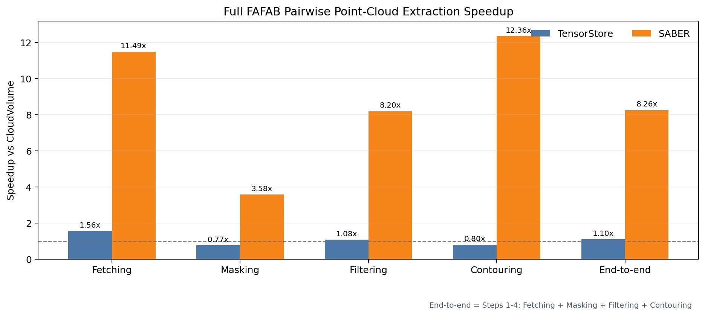

# SABER Compressed Block Optimization

SABER adds compressed-domain operators for neuro-tracking workloads that would
otherwise materialize large dense segmentation cutouts. The core path keeps
sharded `compressed_segmentation` data in small compressed blocks, filters by
target segment IDs, and runs the point-cloud extraction workflow with lower
memory bandwidth pressure.

The repository contains four pieces:

- `compressedvoxel.py`: Python-facing `CompressedVoxelContainer` used by SABER.
- `src/` and `include/`: the local `compressed_segmentation` extension changes.
- `cloud-volume/`: the vendored CloudVolume source with opt-in SABER read paths.
- `cloud-files/`: the vendored CloudFiles source with SABER cache-thread support
  (`use_optional_thread`), pinned to `384945895bb8969e93ee83732ff7e956f4588e51`.

CloudVolume changes are aligned against upstream commit:

```text
ed2cba49ae15333bf602ba8b359cfd55de1bba98
```

## Clone

Clone the repository. The compatible CloudVolume and CloudFiles sources are
included, so no submodule initialization is required:

```bash
git clone https://github.com/11011d/SABER.git
cd SABER
```

## Setup

Install the local CloudFiles and CloudVolume checkouts, build the local
`compressed_segmentation` extension, and optionally patch `cloudfiles` local
cache reads:

```bash
python scripts/setup_saber_env.py --patch-cloudfiles
```

The setup script:

- installs `./cloud-files` in editable mode;
- installs `./cloud-volume` in editable mode;
- runs `python setup.py build_ext --inplace`;
- optionally backs up `cloudfiles.py` as `cloudfiles.py.saber.bak` and patches
  local `file://` cache reads;
- verifies that the active `compressed_segmentation` module exposes
  `PyBlockStore` and `extract_to_container`.

To replace an already-installed Python environment in-place, use the explicit
library replacement script. You must pass the actual Python library directory
used by the target interpreter, usually that interpreter's `site-packages`:

```bash
python scripts/replace_python_libs_with_saber.py \
  --python-lib-dir /opt/miniconda3/lib/python3.10/site-packages \
  --python /opt/miniconda3/bin/python
```

The script backs up existing `cloudfiles`, `cloudvolume`,
`compressed_segmentation*.so`, and `compressedvoxel.py` targets into a
timestamped `saber-backup-*` directory. Before copying, it rebuilds
`compressed_segmentation` with the target `--python`, so the extension matches
that environment's Python and NumPy ABI. It then copies this repository's SABER
versions into the provided library directory and verifies that imports resolve
from that location. It also verifies that `CloudFiles.__init__` accepts
`use_optional_thread`, which is required by `cache_thread`. Use `--dry-run`
first to inspect the paths without changing the environment.

The replacement script does not install unrelated runtime dependencies. The
target environment must already provide the dependencies used by
`compressedvoxel.py`, including `connected-components-3d` (`cc3d`) and OpenCV
(`cv2`). Because the extension is rebuilt with the target Python, make sure
those build dependencies and the target NumPy version are already installed in
that environment.

## CloudVolume Usage

Compressed block mode is explicit:

```python
from cloudvolume import CloudVolume

vol = CloudVolume(
    "/path/to/precomputed-volume",
    mip=0,
    fill_missing=True,
    cache=True,
    saber=True,
    cache_thread=0,
)

vol.segid_list = [segid1, segid2]
cutout = vol[x0:x1, y0:y1, z0:z1]
```

`cutout` is a `CompressedVoxelContainer` when `saber=True`.
Without that flag, CloudVolume keeps the normal dense `VolumeCutout` behavior.
Use `saber_debug=True` when detailed SABER timing and cache counters are needed.

The original per-slice contour method remains available for older callers:

```python
mask.extract_boundary_points(
    x_off, y_off, z_off, lx, ly, lz, pc_data, ids_data,
    origin=(x0, y0, z0),
)
```

`extract_boundary_points` is the legacy **2D per-z-slice** OpenCV contour path.
Its return value is `(pc_data, ids_data)`, the same mutable lists provided by
the caller after appending results.

| parameter | meaning |
| --- | --- |
| `x_off`, `y_off`, `z_off` | Historical global-center arguments. They remain required for source compatibility but are not used to derive output coordinates. |
| `lx`, `ly`, `lz` | Historical local-center offsets. They remain required for source compatibility but are not used to derive output coordinates. |
| `pc_data` | Mutable list receiving one `float32` `(N, 3)` array per detected 2D contour. |
| `ids_data` | Mutable list extended by one `label` per emitted point. |
| `label` | Integer carried by all points emitted for this mask; default `0`. |
| `origin` | Optional three-element requested-bbox origin in voxel coordinates. It defaults to `requested_bbox.minpt`. |

The current **3D six-neighbor boundary** path is:

```python
mask.extract_boundary_voxel_points_3d(
    origin=(x0, y0, z0),
    pc_data=pc_data,
    ids_data=ids_data,
    label=0,
)
```

| parameter | meaning |
| --- | --- |
| `origin` | Required three-element requested-bbox origin in CloudVolume voxel coordinates. |
| `pc_data` | Mutable list receiving one `float32` `(N, 3)` boundary-point array when points exist. |
| `ids_data` | Mutable list extended by one `label` per emitted boundary voxel. |
| `label` | Integer carried by all points emitted for this mask; default `0`. |

Both methods emit `point = origin + local_voxel` in CloudVolume voxel
coordinates. They do not accept, store, or apply a physical voxel resolution;
the caller owns any conversion to nm or another physical coordinate system.

`test.py` keeps the standard 3D six-neighbor comparison by default. To run the
legacy 2D contour API against its equivalent dense reference instead, use:

```bash
SABER_BOUNDARY_MODE=legacy_2d python test.py
```

See [docs/cloudvolume_saber_features.md](docs/cloudvolume_saber_features.md)
for the full list of added options and return-value rules.

## Validation

Run the standardized correctness and performance comparison:

```bash
python benchmarks/saber_compare.py \
  --cloudpath /path/to/precomputed-volume \
  --candidate-file data/candidate0.csv \
  --json-out /tmp/saber_compare.json
```

The benchmark compares compressed-block output against the dense baseline by:

- point count;
- sorted point coordinates;
- point labels;
- stage timings for fetch, masking, connected component extraction, boundary
  extraction, and total runtime.

To rescan valid candidate indices instead of using the fixed representative
list:

```bash
python benchmarks/saber_compare.py --scan-valid --json-out /tmp/saber_compare_scan.json
```

## Latest Benchmark Snapshot

Full FAFAB pairwise extraction with 3D 6-neighbor boundary voxels:

```text
86958 pair tasks
52 processes
chunksize = 8
sampling disabled
```



## Experiment Script

`test.py` is retained as a lightweight experiment script. Prefer
`benchmarks/saber_compare.py` for repeatable validation and JSON output.

## Development Notes

- Generated files such as `build/`, `.eggs/`, `*.so`, and `*.egg-info/` are
  ignored by `.gitignore`.
- `cloud-volume/` and `cloud-files/` are vendored at the revisions listed above
  so a public clone contains the complete compatible implementation.
- `src/compressed_segmentation.cpp` is generated from the Cython source. Built
  extension binaries are platform-specific and are not committed.
